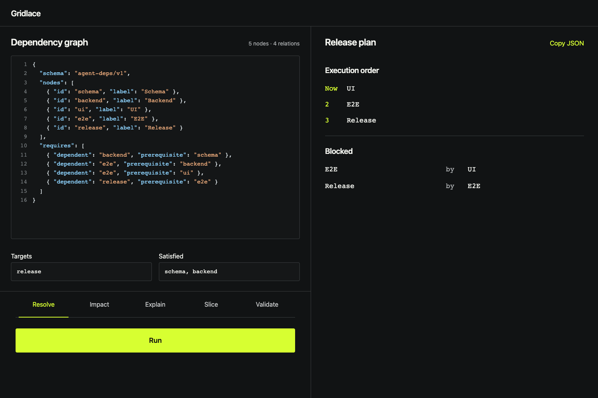

# Gridlace

**A Deterministic Dependency Engine** for humans and AI agents.

The name evokes points laced into a changing pattern: move one declared
relation and the consequences across the structure change. It is an image, not
a claim that the engine uses a regular grid or provides a graph editor.



It answers five questions over relations you declare:

- Is this dependency graph valid and acyclic?
- What remains before these targets can be completed?
- What can run now and in which parallel layers?
- What will these changes affect?
- Why is this target blocked or affected?

The engine proves derivations over declared relations. It does **not** prove
that the declared business relations are true.

This repository is deliberately limited to dependency reasoning. It is not a
general orchestration standard, provider-selection framework, task runner,
graph discovery system, graph database, or visual graph editor.

## Graph contract

```json
{
  "schema": "agent-deps/v1",
  "nodes": [
    { "id": "schema" },
    { "id": "backend" },
    { "id": "release" }
  ],
  "requires": [
    { "dependent": "backend", "prerequisite": "schema" },
    { "dependent": "release", "prerequisite": "backend" }
  ]
}
```

Public edges never use ambiguous `from` / `to` keys.

## Develop

Use Node.js 22 or newer.

This repository is the public source distribution. It is not currently
published to the npm registry.

```sh
npm ci
npm run check
npm run start:ui
```

After `npm run check`, CLI requests can be run from a clone as operation-specific
JSON read from standard input or an explicit `--input` file:

```sh
node dist/adapters/cli.js resolve --input request.json --pretty
```

If you install a locally packed copy, the same entry point is available as
`dependency-engine`.

The MCP server exposes `graph_validate`, `dependency_resolve`,
`dependency_impact`, `dependency_slice`, and `dependency_explain`. The local
HTTP adapter exposes matching `POST /v1/*` routes and `GET /health`. When the
npm package is installed from a local pack rather than cloned, run the MCP entry point as
`node node_modules/@openadam/dependency-engine/dist/adapters/mcp.js`.

Start the built local HTTP adapter with:

```sh
node dist/adapters/http-server.js --host 127.0.0.1 --port 8787
```

The HTTP adapter defaults to `127.0.0.1` and is intended for trusted local use.
It does not provide authentication, authorization, or TLS. Do not expose it
directly to an untrusted network; see [the security policy](SECURITY.md).

## License

Copyright 2026 openAdam. Licensed under the
[Apache License 2.0](LICENSE). Bundled browser dependencies are documented in
[the third-party notices](THIRD_PARTY_NOTICES.md). The license does not grant
rights to the Gridlace or openAdam names; see the [brand policy](TRADEMARKS.md).

See [the product identity](docs/PRODUCT_IDENTITY.md),
[product model](docs/PRODUCT_MODEL.md), and
[review contract](docs/REVIEW_CONTRACT.md) for exact boundaries.
